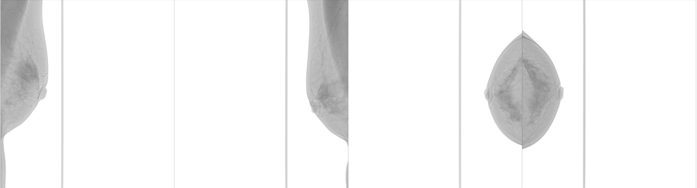
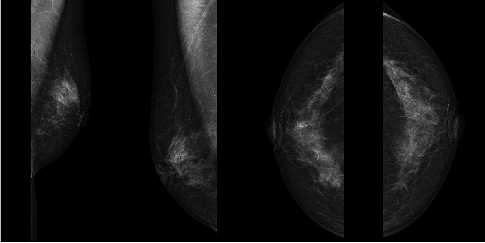
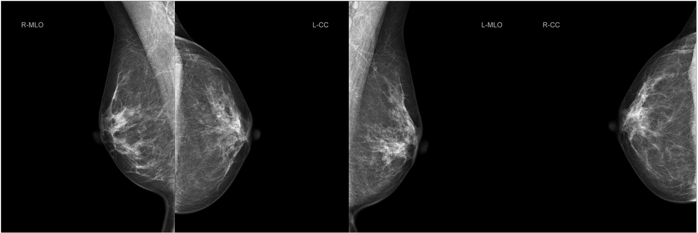
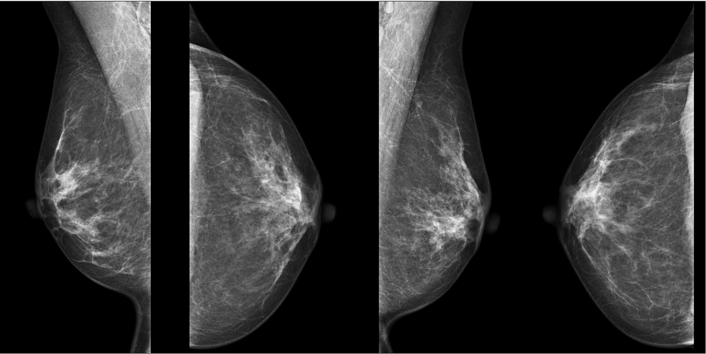

# Train Code for RSNA Screening Mammography Breast Cancer Detection

https://www.kaggle.com/competitions/rsna-breast-cancer-detection

Dataset:

    Total unique patients: 11913
    Total unique images: 54706

For each patient there are multiple images of the L or R breast having MLO(mediolateral oblique) and CC(craniocaudal) views and 
The requirement is to predict the probability of cancer for each of the patients breasts.

- imbalanced dataset with only 1158 images containing cancer from the total of 54706.
- cancer size is very small relative to mammography

Data Preprocessing:
 - photometric-interpretation: as you can see Patient1 and Patient2 have different photometric-interpretations
 - windowing: also known as the "VOI-LUT" (Value of Interest-Look-Up Table) transform
 - normalize:
 - crop and resize

Patient1 Raw Images:

Patient1 Processed Image:

Patient2 Raw Images:

Patient2 Processed Image:

Neural Network Overview:

Description:

- resize image to 1536x768
- split image in 9 patches of size 512x256 to capture fine details from the original image.
- for each patch extract a feature map using resnet34, pretrained model, as well as a feature vector obtained through attention module as a replacement for GAP
- patch feature vector is used as input to auxiliary BCE loss.
- the feature maps of the patches are re-assembled to form the global feature map
- resnet block + attention to form a global feature vector using as input the global feature map
- concat global feature vector and patch feature vector to be used for BCE loss and prediction

